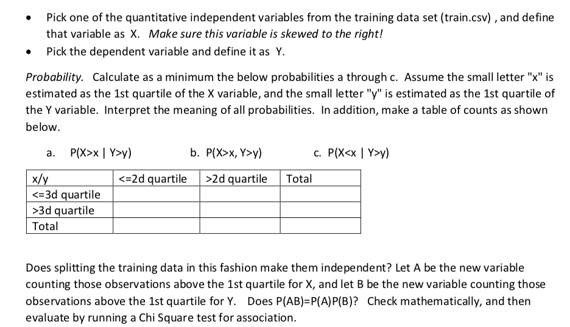
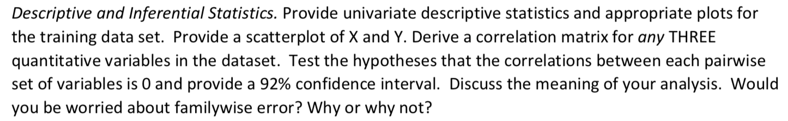
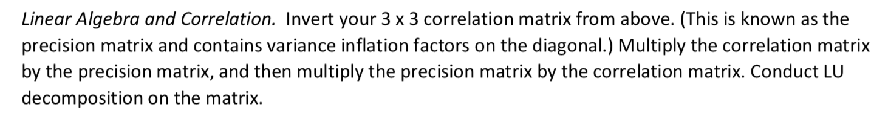
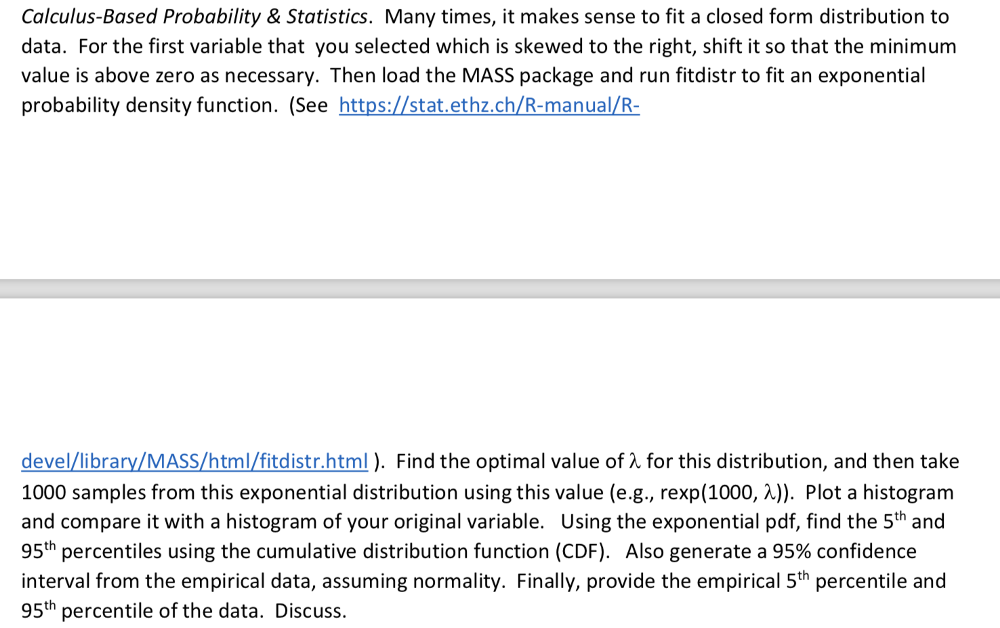

```{r setup, include=FALSE}
knitr::opts_chunk$set(echo = TRUE)
if (!require('tidyverse')) install.packages('ResourceSelection')
library(tidyverse)
if (!require('psych')) install.packages('psych')
library(psych)
if (!require('corrplot')) install.packages('corrplot')
library(corrplot)
if (!require('plotrix')) install.packages('plotrix')
library(plotrix)
if (!require('knitr')) install.packages('knitr')
library(knitr)
if (!require('MASS')) install.packages('MASS')
library(MASS)
if (!require('ResourceSelection')) install.packages('ResourceSelection')
library(ResourceSelection)
if (!require('GGally')) install.packages('GGally')
library(GGally)

## Global options
options(max.print="999999999")
opts_chunk$set(echo=FALSE,
	             cache=TRUE,
               prompt=FALSE,
               tidy=TRUE,
               comment=NA,
               message=FALSE,
               warning=FALSE)
opts_knit$set(width=75)
```


## Question 1: Probability



First we have to load the train.csv from Kaggle competition to start our analysis.
1. Next we have to pick two variables one dependent and another independent variables.


```{r}
# Let us load the train.csv data

kaggletrain = read.csv('train.csv')

#summary(kaggletrain)

#hist(kaggletrain$LotArea)
ggplot(data=kaggletrain, aes(kaggletrain$GrLivArea)) + geom_histogram()  +ggtitle( "Gr Liv Area")
#hist(kaggletrain$GrLivArea)

ggplot(data=kaggletrain, aes(kaggletrain$SalePrice)) + geom_histogram()  +ggtitle( "Sale Price")

# From the summary function we can see that LotArea and GrLivArea can be used for X Variable.
# From the hist for GrLivArea it show some right skeweness. So we are picking GrLivArea.
# For Y Variable the obvious choice is SalePrice.
# GrLivArea is defined as Above grade (ground) living area square feet.

```

For X Variable we will be using 
$$ GrLivArea $$ and 
For Y Variable we will be using
$$ SalePrice $$


```{r}
# Let us see the summary of X and Y variables.

# From the Kaggle Data Set we will separate X and Y Variables.

XYCol = c('GrLivArea','SalePrice')
XYData = kaggletrain[XYCol]

summary(XYData$GrLivArea)

summary(XYData$SalePrice)

# We have to take the 1st quartile for x and 1st quartile for y.
x = quantile(XYData$GrLivArea, probs = 0.25)
x

y= quantile(XYData$SalePrice, probs = 0.25)
y


```


Problem 1: P(X > x | Y > y)


```{r}
#This question asks for Conditional Probability.
# P(X > x and Y > y) divided by P(Y > y)
prob1 = nrow(subset(XYData, XYData$GrLivArea > x & XYData$SalePrice > y)) / nrow(XYData)
#prob1
# Probability P(Y > y)
prob2 = nrow(subset(XYData, XYData$SalePrice > y)) / nrow(XYData)
#prob2
prob1 / prob2

# 

```
***This question say Probability of GrLivArea greater than `r x` given the Sales Price greater than `r y` is `r prob1/prob2`.***
***These two has dependence.***

Problem 2 : P(X >x , Y > y)

```{r}
# Joint Probability.
prob1 = nrow(subset(XYData, XYData$GrLivArea > x & XYData$SalePrice > y)) / nrow(XYData)
prob1
```

***This question say Probability of GrLivArea greater greater than `r x` and the Sales Price greater than `r y` is `r prob1`.***

Problem 3: P(X < x | Y > y)

```{r}
#This question asks for Conditional Probability.
# P(X < x and Y > y) divided by P(Y > y)
prob1 = nrow(subset(XYData, XYData$GrLivArea <= x & XYData$SalePrice > y)) / nrow(XYData)
#prob1
# Probability P(Y > y)
prob2 = nrow(subset(XYData, XYData$SalePrice > y)) / nrow(XYData)
#prob2
prob1 / prob2
```

***This question say Probability of GrLivArea lesser than `r x` given the Sales Price greater than `r y` is `r prob1/prob2`.***


Table to be built.

```{r}
#GrLivArea <= 25% and SalesPrice <= 25%
# (1,1)X <= 1st quartile & Y <= 1st quartile
a = nrow(subset(XYData, XYData$GrLivArea <= x & XYData$SalePrice <= y))
#GrLivArea <= 25% and SalesPrice > 25%
# (1,2) X <= 1st quartile & Y > 1st quartile
b = nrow(subset(XYData, XYData$GrLivArea <= x & XYData$SalePrice > y))
#GrLivArea > 25% and SalesPrice <= 25%
# (2,1) X > 1st quartile & Y <= 1st quartile
c = nrow(subset(XYData, XYData$GrLivArea > x & XYData$SalePrice <= y))
#GrLivArea > 25% and SalesPrice > 25%
# (2,2) X > 1st quartile & Y > 1st quartile
d = nrow(subset(XYData, XYData$GrLivArea > x & XYData$SalePrice > y))

tabledata = matrix(c(a,b,c,d), nrow = 2, ncol = 2)

tabledata<- cbind(tabledata, Total = rowSums(tabledata))
tabledata<- rbind(tabledata, Total = colSums(tabledata))

rownames(tabledata)<- c('(X <= 1st quartile)', '(X > 1st quartile)', 'Total')
knitr::kable(tabledata, digits = 2, col.names = c('(Y <= 1st quartile)', '(Y > 1st quartile)', 'Total'), align = "l", caption = 'Table Data')

```

***Splitting the data in above format does not make them independent. ***
***Of the house in the top 75% in GrLivArea , about 91% of them are in top 75% of SalePrice.***
***This is from `r d` which is 91% of Total(1095). This makes them dependent.***

Let A be the new variable counting those observations above the 1st Q of X, and B be new variable counting those above 1st Q for Y.

```{r}
# Mathematically checking P(AB) = P(A)P(B)
A=nrow(subset(XYData, XYData$GrLivArea > x))
B=nrow(subset(XYData, XYData$SalePrice > y))
# P(A)
pA = A / nrow(XYData)
# P(B)
pB = B / nrow(XYData)
# P(A|B)
pAB = nrow(subset(XYData, XYData$GrLivArea > x & XYData$SalePrice > y)) / nrow(XYData)
```


P(A)P(B)
```{r}
pA * pB
```
P(AB)
```{r}
pAB

```

***Null Hypothesis : GrLivArea and SalePrice are Independent.***

```{r}
(chiinput = table(XYData$GrLivArea > x , XYData$SalePrice > y))
(chitest = chisq.test(chiinput))

```

***From the above we can say that Mathemathically.***

$$ P(AB) <> P(A)P(B)$$ 

***The output of Chi Test gave a p-value which is less than 0.05.*** 
***We can Reject the Null Hypothesis and accept the Alternative Hypothesis.***
***Saying the GrLivArea and SalePrice are dependent to each other.***


## Question 2: Descriptive and Inferential Statistics : 



First we will provider univariate descriptive stats and plots for training data set.

```{r}
knitr::kable(psych::describe(XYData))

```


***From the above descriptive stats we can see Mean/SD is 1515/525 for GrLivArea and 180921/79442 for SalePrice.***

Next we will put the plots for x, y and scatter plot for X and Y

```{r}
ggplot(data=XYData, aes(XYData$GrLivArea)) + 
  geom_histogram(binwidth=50, colour = 'red', 
        fill = 'gray45', aes(y=..density.., fill=..count..))  + 
  scale_x_continuous(name = "Above Grade Living Area(sq.ft.)") +
  stat_function(fun=dnorm, color="blue",
                args=list(mean=mean(XYData$GrLivArea), sd=sd(XYData$GrLivArea))) +
  ggtitle( "Histogram for Gr Liv Area")

```


We can see that it is Rightly Skewed. Which means outliers to the right of average.

```{r}
ggplot(data=XYData, aes(XYData$SalePrice)) + geom_histogram(binwidth=10000, colour = 'red', 
        fill = 'gray45', aes(y=..density.., fill=..count..))  + 
  scale_x_continuous(name = "Sales Price in $") +
  stat_function(fun=dnorm, color="blue",
                args=list(mean=mean(XYData$SalePrice), sd=sd(XYData$SalePrice))) +
  ggtitle( "Sale Price")
```


We can see that it is Rightly Skewed. Which means outliers to the right of average.

Next we plot a scatter plot between X and Y

```{r}
ggplot(XYData, aes(x=XYData$GrLivArea, y=XYData$SalePrice)) + geom_point()  +
  labs(title="Living Area vs. Sale Price",x="Living Area in Sq.Ft", y = "Sale Price in $")

```


Next we have to check the correlation for three variables from KaggleData.

***The three variables are LotArea, GrLivArea and GarageArea. We will see how they are correlated and plots.***

```{r}
corthree = cor(kaggletrain[c('LotArea','GrLivArea','GarageArea')])
corthree

corfit= corrplot(corthree)


```

Testing all three unique correlations at 92% Confidence Interval. 

```{r}
#
cor.test(kaggletrain$LotArea,kaggletrain$GrLivArea,conf.level = 0.92)

cor.test(kaggletrain$LotArea,kaggletrain$GarageArea,conf.level = 0.92)

cor.test(kaggletrain$GrLivArea,kaggletrain$LotArea,conf.level = 0.92)


```


***For all of the above since the p-value is very low that 0.05*** 
***we can reject Null Hypothesis that Correlation between the variables in Zero***

***Since we are rejecting the Null Hypothesis for all three condition, we should be worried about Type 1 Error.***
***For Controlling of Family Wise Error, we have two corrections to make Single Step and Sequential.***
***Both of these corrections needs manupulation of p-value.***
***Since in our case the p-value are very low. We can ignore Type 1 Error.***


## Question 3: Linear Algebra and Correlation:



```{r}
# Let us create correlation matrix from Q2.
cormatrix = corthree
```

Precision Matrix is inverse of corrmatrix.
```{r}
precisionmatrix = solve(cormatrix)
precisionmatrix
```
Now we have to multiply Corr Matrix and Prec Matrix.
```{r}
round(cormatrix %*% precisionmatrix)
```
Precision Matrix multiplied by Corr Matrix
```{r}
round(precisionmatrix %*% cormatrix)
```
In both of the above scenarios we are getting Identity Matrix.

Next we will do the LU Decomposition of Precision Matrix as discussed in Discussion Forum.

```{r}
# Using the code from home work 2 for LU Decomposition.
# LU Composition

LU = function(A){
  #Step 1: To check whether the input is Square Matrix
  r=nrow(A)
  c=ncol(A)
  if(r!=c){
    return("The Input Matrix A is not a Square Matrix")
  }
  #Initializing L and U
  L = diag(nrow(A))
  U = A
  for (i in 2:nrow(A)){
    for(j in 1:(i - 1)){
    # Using Identity Matrix
      I = diag(nrow(A))
      I[i, j] = -(U[i,j]/U[j,j])
      U = I %*% U
      L = L %*% solve(I)
    }
  }
  print("Value of L")
  print(L)
  print("Value of U")
  print(U)
  print("A = LU")
  print(L %*% U)
}


testoutput = LU(precisionmatrix)

#precisionmatrix
```


## Question 4: Calculus-Based Probability and Statistics



From our data set both the variables min value are greater than zero, so no shift needed.
Even though both are skewed right we will take GrLivArea for this problem.

```{r}

CalXYData = XYData

describe(CalXYData$GrLivArea)
describe(CalXYData$SalePrice)


```

Then Load the MASS package and run firdistr to fit an expo PDF.


```{r}
#install.packages("MASS", repos='https://mirrors.nics.utk.edu/cran/')
#library(MASS) 

fitdis = fitdistr(CalXYData$GrLivArea, "exponential")
fitdis
#CalXYData$GrLivArea
```

Find the optimal value lambda for this distribution, then take 1000 samples from this expo PDF useing this lambda value.

***The optimal value lambda***

```{r}
#  
lambda = fitdis$estimate
lambda

```

Next picking of 1000 samples from fitdis using the lambda value.
```{r}
r = rexp(1000, lambda)

```


***Plot the histogram and compare it with the original histogram.***

```{r}
hist(r, freq = FALSE)

hist(CalXYData$GrLivArea, freq = FALSE)

m = multhist(list(r,CalXYData$GrLivArea))

```


***Using the exponential PDF, find the 5th and 95th percentile using the cumulative distribution function.***

```{r}
cdfp=ecdf(r)
plot(cdfp)
```

The 5th and 95th Percentile for the CDF sample

```{r}
quantile(cdfp, probs = 0.05)
quantile(cdfp, probs = 0.95)

```

Also generate a 95% confidence interval from the empirical data, assuming normality.

```{r}
t.test(CalXYData$GrLivArea)

```

***The 95% confidence interval ranges between 1488.487 and 1542.440***

Finally, provide the empirical 5th percentile and 95th percentile of the data.

```{r}
quantile(CalXYData$GrLivArea, probs = 0.05)
quantile(CalXYData$GrLivArea, probs = 0.95)
```


**From the above analysis we can see that 5th and 95th percentile of exponential data deviates a lot from the 5th and 95th percentile of the emprical data.**
**Instead of Exponential fit, we should go for normal distribution.**


## Question 5 : Modelling.

Build Some type of multiple regression model and submit your model to the competition board. Provider your complete model summary and results with analysis. 
Report your kaggle.com user name and score.


***Data cleansing : Removal of NAs***

```{r}
sapply(kaggletrain, class)


kaggletrain%>%
  replace_na(kaggletrain,list(MSSubClass = 0, LotFrontage = 0, LotArea = 0, OverallQual = 0, OverallCond = 0, YearBuilt = 0,
                              YearRemodAdd = 0, MasVnrArea = 0, BsmtFinSF1 = 0 ,BsmtFinSF2 = 0,TotalBsmtSF = 0,X1stFlrSF = 0,X2ndFlrSF = 0, GrLivArea = 0,BsmtFullBath = 0,BsmtHalfBath = 0,PoolArea = 0 ,FullBath = 0,                                     HalfBath =0 , BedroomAbvGr = 0,KitchenAbvGr = 0, KitchenQual = 0,TotRmsAbvGrd = 0,Fireplaces = 0,GarageCars = 0, GarageArea = 0,WoodDeckSF = 0,OpenPorchSF = 0,ScreenPorch = 0,SalePrice =0 ))


```

***Step 1: First we will see the linearity between Dependent Variable and Independent Variables.***
***For us the dependent variable is SalePrice and independent variable are rest.***

***From the entire data set, picked few numeric variables to see how they are with SalePrice.***

```{r}

numericdata  = kaggletrain[c(  'LotArea', 'TotalBsmtSF', 'GrLivArea','FullBath','HalfBath' ,'TotRmsAbvGrd','WoodDeckSF','SalePrice','BedroomAbvGr','GarageArea')]

kdepairs(numericdata)

```

***From the above plot we can see the following strong correlation betweem (GrLivArea,TotalBsmtSF,FullBath,TotRmsAbvGrd)  and Sale Price***

***Step 2 : Next we will check the linearity and correlation between independent variables.***
***This is need to check Multicollinearity. ***

```{r}
multicol = subset(numericdata, select = -c(SalePrice))
ggcorr(multicol)

```

***From the above analysis we can see GrLivArea and TotRmsAbvGrd has a high correlation, So we mught have to drop one***
***We cannot drop GrLivArea so we can think about TotRmsAbvGrd. But for Initial analysis we will take all into consideration and will decide based on ***
***P-Value which one to reject when we do the model.***

***Step 3 : Linear Model***

***For first we will create a model with SalePrice and all other independent variables we are interested with.***

```{r}

mutlireg = lm(SalePrice ~ MSSubClass + LotFrontage + LotArea + Street+ YearBuilt+  OverallQual + OverallCond + MasVnrArea + BsmtFinSF1 + BsmtFinSF2 + BsmtUnfSF + TotalBsmtSF + BsmtFullBath + BsmtHalfBath +X1stFlrSF +                     X2ndFlrSF + GrLivArea + FullBath + HalfBath + BedroomAbvGr + KitchenAbvGr + TotRmsAbvGrd + GarageCars+ GarageArea + WoodDeckSF + OpenPorchSF + PoolArea + EnclosedPorch  + Fireplaces + YrSold, 
              data = kaggletrain)

summary(mutlireg)

```

***From the above analysis we can elimnate variables with higher p-Values. OpenPorchSF ,Street, X2ndFlrSF and many other values to see how the $$ R^2 $$ and adjusted R^2 are changing.***

```{r}
mutlireg2 = lm(SalePrice ~ MSSubClass + LotFrontage + LotArea +  YearBuilt+  OverallQual + OverallCond + MasVnrArea + BsmtFinSF1 + TotalBsmtSF + BsmtFullBath + GrLivArea + FullBath +  BedroomAbvGr + KitchenAbvGr + TotRmsAbvGrd + GarageCars+ WoodDeckSF +  PoolArea + Fireplaces  , 
              data = kaggletrain)

summary(mutlireg2)

```

***From the above model we can see, the R-Squared more or less remained the same but there is a marginal improvement in Adjusted R - Squared.***


***Step 4 : Residual Analysis.***
```{r}
plot(fitted(mutlireg2), resid(mutlireg2))
abline(h=0)


qqnorm(mutlireg$residuals)
qqline(mutlireg$residuals)


qqnorm(mutlireg2$residuals)
qqline(mutlireg2$residuals)


```

***Comparing the QQ Plot of the Model 1 and  Model 2, the Model2  plot looks little better in terms of not heaveir tail on the top.***
***So this concludes our second model is better compared to the first model.***

***Step 5 : Predicting and Submitting to Kaggle. ***

```{r}
kaggletest = read.csv('test.csv')
outprediction = predict(mutlireg2, newdata = kaggletest,type = 'response')
#outprediction

outprediction[is.na(outprediction)] = mean(kaggletrain$SalePrice)
submission = data.frame(list("Id"=kaggletest$Id, "SalePrice"=outprediction), stringsAsFactors = FALSE)
head(submission)

write.csv(submission, file="submission.csv", row.names=FALSE, col.names=TRUE,sep='\t')

```

#### Kaggle Website Details

UserName:dillynesan 
DisplayName:DilipGanesan 
Email:dilipgan@gmail.com

#### Presentation Link
https://www.youtube.com/watch?v=X1yRPlPSz6I

#### Final Score.


***Still we have some scope for improvement.***

***If you remember our Dependent variable was rightly skewed. In order to make it to fit a normal distribution, we can apply log transformation on the dependent variable.***
***So we would like to repeat our analysis by applying log transformation on the SalePrice and see what impact it creates.***

Reference : https://stats.stackexchange.com/questions/298/in-linear-regression-when-is-it-appropriate-to-use-the-log-of-an-independent-va/3530#3530

## Reference

http://www.gs.washington.edu/academics/courses/akey/56008/lecture/lecture10.pdf 

https://rpubs.com/melike/corrplot

https://stats.stackexchange.com/questions/252367/what-can-one-say-about-these-cor-test-results 

https://ms.mcmaster.ca/~bolker/R/misc/multhist.pdf 

https://stats.stackexchange.com/questions/30858/how-to-calculate-cumulative-distribution-in-r 

https://stats.stackexchange.com/questions/298/in-linear-regression-when-is-it-appropriate-to-use-the-log-of-an-independent-va/3530#3530

https://stats.stackexchange.com/questions/18844/when-and-why-should-you-take-the-log-of-a-distribution-of-numbers

https://www.kaggle.com/jimthompson/regularized-linear-models-in-r

https://www.analyticsvidhya.com/blog/2016/03/select-important-variables-boruta-package/

https://rdrr.io/cran/tidyr/man/replace_na.html
